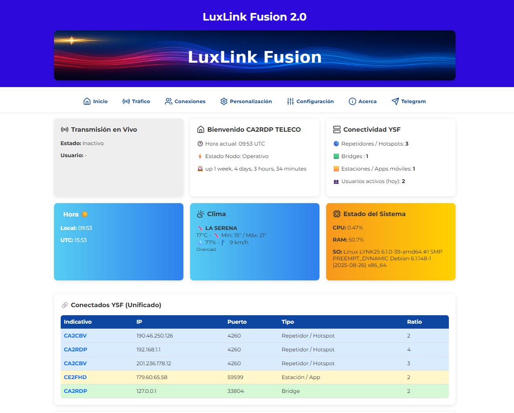

# 🌐 LuxLink Fusion — YSF / C4FM Dashboard  

**Web-based monitoring system for YSF / Fusion reflectors**  
**Developed by CA2RDP - Telecoviajero**

🇺🇸 English | 🇪🇸 [Español](README.md)

---

LuxLink Fusion is a modern, fast, and fully customizable dashboard designed to monitor in real time the activity of a **YSF / C4FM reflector**.

It provides a clear and powerful visualization of:
- Server status  
- Connected stations  
- Live traffic  
- Activity history  
- System alerts  
- Secure administration panel  

💡 The name **LuxLink Fusion** is inspired by *Lucas*, my son — reflecting colors, design, and energy based on his joy and personality.

Since version **2.0**, the system includes multi-language support (English / Spanish).

---

## 📸 Dashboard

---

## 🎬 Demo / Presentation

👉 https://youtu.be/DxGOtfyECLk?si=vwXx8dPa3arKAv_y

---

## 🌍 Project Ecosystem

This project is part of a suite of open dashboards:

- **LYNK25 (P25)**
- **AuroxLink (SVXLink / EchoLink)**
- **LuxLink Fusion (YSF / Fusion)** ← this repository

---

## 🚀 Key Features

### 🔥 Real-Time Monitoring
- Live connected stations list  
- Highlighted last transmission  
- User identification via **RadioID + QRZ**

### 📊 Server Metrics
- CPU, RAM, Disk usage, Uptime  
- Configurable local time (Timezone)  
- YSF reflector status  

### 🧭 Admin Panel
- Secure access (default password: `luxlink2024`)  
- Full customization:
  - Title  
  - Colors  
  - Banner  
  - Author  
  - Timezone  
  - Weather city  
  - Language (EN / ES)  
  - Temperature format (°C / °F)

### 📝 Logs & Analytics
- Transmission history  
- Connection / disconnection tracking  

---

## 📦 Installation
👉 [Installation Guide](install.en.md)

## 📝 Changelog
👉 [View Changes](CHANGELOG.md)

---

## 🧑‍💻 Author

**CA2RDP - Telecoviajero**  

Amateur radio operator, self-taught developer, and content creator focused on telecommunications and open-source solutions.

- 🌐 GitHub: https://github.com/telecov  
- 🌐 QRZ: https://www.qrz.com/db/CA2RDP  
- 🎵 TikTok: https://tiktok.com/@telecoviajero  
- 📸 Instagram: https://instagram.com/telecoviajero  
- 📺 YouTube: https://www.youtube.com/@Telecoviajero  

---

## ❤️ Support the Project

  <b>If this project has helped you, consider supporting it 🚀</b>  

  

    
  <i>Your support helps keep developing tools and content for the radio community 📡</i>

