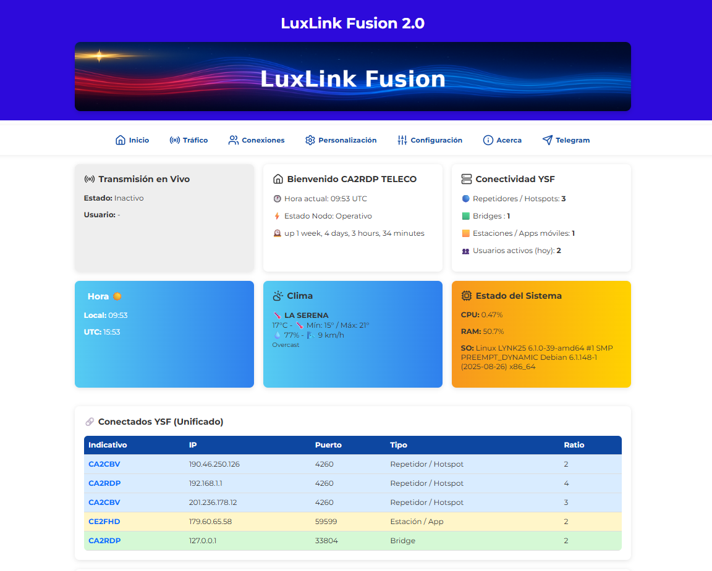

# 🌐 LuxLink Fusion — Dashboard YSF / C4FM  
**Sistema de visualización web para Reflectores YSF / Fusion**  
**Desarrollado por CA2RDP - Telecoviajero**

LuxLink Fusion es un dashboard moderno, rápido y personalizable, para visualizar en tiempo real la actividad de un reflector **YSF / C4FM**, estado del servidor, estaciones conectadas, tráfico actual, historial, alertas y panel de administración protegido. el nombre LuxLink Fusion, viene inspirado de LUCAS, mi hijo, colores, tipografia y formas todo inspirado en su alegria y actividad de niño.

## DASHBOARD 

Este proyecto nace como parte del ecosistema de dashboards abiertos:
- **LYNK25 (P25)**
- **AuroxLink (SVXLink / EchoLink)**
- **LuxLink Fusion (YSF / Fusion) ← este repositorio**

---

## 🚀 Características principales

### 🔥 Tiempo Real
- Lista de estaciones conectadas con actualización automática.  
- Última transmisión destacada.  
- Identificación de usuario mediante **RadioID + QRZ **.

### 📊 Métricas del servidor
- Carga CPU, Uptime, RAM, Disco.
- Fecha/hora local configurable (TZ).
- Estado del reflector YSF.

### 🧭 Panel de administración
- Acceso protegido (password por defecto: luxlink2024).  
- Personalización de:
  - Título  
  - Colores primario/secundario  
  - Banner  
  - Radioaficionado/autor  
  - Zona horaria  
  - Ciudad del clima  

### 📝 Logs y análisis
- Historial de transmisiones.  
- Últimas conexiones/desconexiones.   

---

## 👉 [Ver instalacion](install.md) 

## 👉 [Cambios recientes al codigo](CHANGELOG.md) 

## 🧑‍💻 Autor

CA2RDP - TelecoViajero
Radioaficionado, desarrollador autodidacta y creador de contenidos digitales:

# 🌐 GitHub: https://github.com/telecov
# 🔗 TikTok: https://tiktok.com/@telecoviajero
# 🔗 Instagram: https://instagram.com/telecoviajero
# 📺 YouTube: https://www.youtube.com/@Telecoviajero
